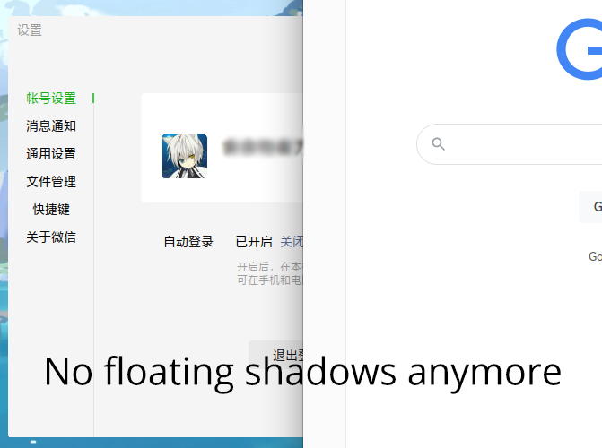

# KWin 脚本: 修复 Wine 微信边缘阴影
💬 通过检测窗口类名以屏蔽 Wine 微信的阴影窗体，也适用于其它程序。

对 https://bugs.winehq.org/show_bug.cgi?id=34631 的一个可行的解决方案。



### 系统需求

- KWin >= 5.14
- 使用 X11 窗口系统
- 安装了 `xdotool` 和 `xprop` 命令

### 安装方法

```bash
./pack.sh
./install.sh
```

### 使用方法

- 在「系统设置」中打开「窗口管理」->「KWin 脚本」
- 启用「修复 Wine 微信边缘阴影」
- 如果有屏蔽其它阴影窗口（比如网易云音乐）的需求，自行在脚本配置中添加即可。

---

### 谢志

部分代码借鉴自 [kwin-forceblur](https://github.com/esjeon/kwin-forceblur)。
